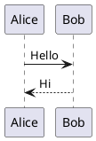

# PlantUML Server

使用 Docker Compose 启动 PlantUML Server，可通过浏览器或 HTTP API 渲染 PlantUML 图表。

## 环境变量配置

先复制环境变量模版：

```bash
cp .env.template .env
```

如需修改宿主机端口或镜像标签，编辑当前目录下的 `.env` 文件：

```bash
# 可选，默认 jetty
PLANTUML_VERSION=jetty

# 可选，默认 18080
PLANTUML_PORT=18080
```

## 启动服务

```bash
docker compose up -d
```

查看服务状态和日志：

```bash
docker compose ps
docker compose logs -f plantuml
```

启动完成后访问：

```text
http://localhost:18080
```

如果修改了 `PLANTUML_PORT`，请将地址中的 `18080` 替换为对应端口。

## 测试渲染

打开下面的地址，可以渲染一个简单的 PlantUML 时序图：

```text
http://localhost:18080/svg/SyfFKj2rKt3CoKnELR1Io4ZDoSa70000
```

也可以在首页文本框中输入：



## 停止服务

```bash
docker compose down
```
